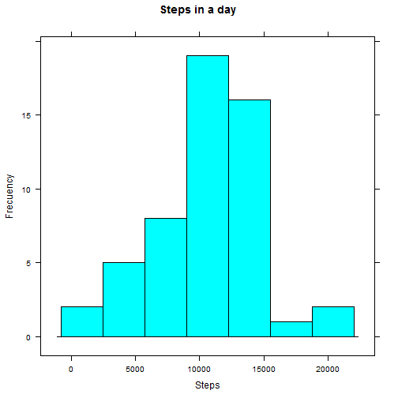
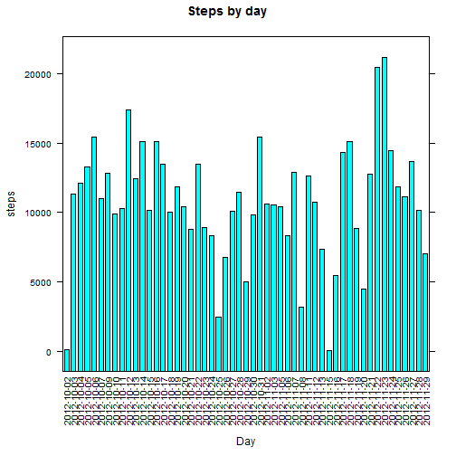
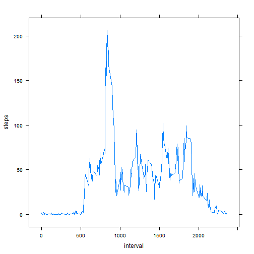
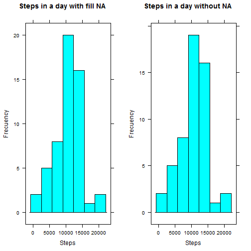
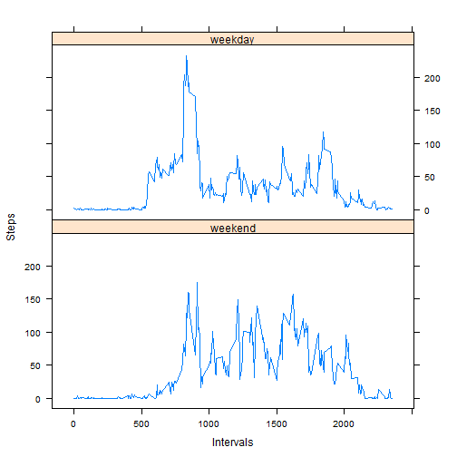

# Reproducible Research: Peer Assessment 1


To run this markdown document; the lattice, grid and gridExtra libraries are necessaries

The document uses R option scipen to adjust the scientific notation:

```r
options(scipen=8)
```


## Loading and preprocessing the data
A conexion is stablished with the data, also a table is create with the information

```r
my_connector <- unz("activity.zip", "activity.csv")
activity <- read.table(my_connector, header=TRUE, sep=",")
```


## What is mean total number of steps taken per day?
First, A Histogram of the steps per day is plotted

```r
steps_per_day <- aggregate(steps ~ date, activity, FUN=function(x) sum(x, na.rm=TRUE))
library(lattice)
histogram(steps_per_day$steps, main="Steps in a day", xlab="Steps", type="count", ylab="Frecuency")
```

 

Other plot that represents the medium steps per day:


```r
barchart(steps ~ date, data=steps_per_day, main="Steps by day", xlab="Day", scales=list(x=list(rot=90)))
```

 

The mean and the median of steps per day is obtained by the next code

```r
mean_steps_per_day <- mean(steps_per_day$steps)
median_steps_per_day <- median(steps_per_day$steps)
```
**Mean of steps per day:** 10766.1887  
**Median of steps per day:** 10765


## What is the average daily activity pattern?
First, a plot of the intervals and steps is created

```r
mean_steps_per_interval <- aggregate(steps ~ interval, activity, FUN=function(x) mean(x, na.rm=TRUE), na.action = na.omit)
xyplot(steps ~ interval, data=mean_steps_per_interval, type="l")
```

 

Now, the 5-min interval with the maximum averaged steps is obtained by the next code:

```r
mean_steps_per_interval[mean_steps_per_interval$steps==max(mean_steps_per_interval$steps),"interval"]
mean_steps_per_interval[mean_steps_per_interval$steps==max(mean_steps_per_interval$steps),"steps"]
```

The 5-min **interval** with the maximun averaged steps is **835** with **206.1698** steps


## Imputing missing values
The number of rows with missing values is calculate by:

```r
nrow(activity[is.na(activity$steps) | is.na(activity$date) | is.na(activity$interval),])
```

The total number of **rows with missing values** is 2304


The **strategy** used to replace the missing values is to change all missing values by the mean of the steps of the 5-min interval.

Now, a new data set with missing values replaced is created by the next code:


```r
activity_fill_na <- activity
my_replace <- function(x){
mean_steps_per_interval[mean_steps_per_interval$interval==x, "steps"]
}
activity_fill_na[is.na(activity_fill_na$steps),"steps"]<- my_replace(activity_fill_na[is.na(activity_fill_na$steps),"interval"])
```

The next step is compared the dataset with missing values and with the missing values replaced

```r
steps_per_day_fill_na <- aggregate(steps ~ date, activity_fill_na, FUN=function(x) sum(x, na.rm=TRUE))
plot_1 <- histogram(steps_per_day_fill_na$steps, main="Steps in a day with fill NA", xlab="Steps", type="count", ylab="Frecuency")
plot_2 <- histogram(steps_per_day$steps, main="Steps in a day without NA", xlab="Steps", type="count", ylab="Frecuency")
library(grid)
library(gridExtra)
grid.arrange(plot_1,plot_2, ncol=2)
```

 

The results are different, but similar. Now its time to calculate the mean and the median of stepts per day after the replacement of the missing values:

```r
mean_steps_per_day_fill_na <- mean(steps_per_day_fill_na$steps)
median_steps_per_day_fill_na <- median(steps_per_day_fill_na$steps)
```

The **mean** of steps per day after the replacement of missing values is 10766.1887  
The **median** of stepts per day after the replacement of missing values is 10765.5943

This values are quite similar to the results without missing values. In mean and median, the **impact** of replacement missing values is practically zero.


## Are there differences in activity patterns between weekdays and weekends?
To answer this question is necessary classify the dates in weekdays and weekends. For one date the functión to classify is:

```r
Obtain_days <- function(x){
x <- format(as.Date(x, "%Y-%m-%d"), "%A")
if (x== "Saturday" | x== "Sunday")
  	return ("weekend")
else
		return ("weekday")
}
```

Now, this function is used to create in dataset a new column in that contains the classification of the day

```r
Sys.setlocale("LC_TIME", "English")
```

```
## [1] "English_United States.1252"
```

```r
days <- vector()
for (i in activity_fill_na$date){
  days <- c(days, i)
}
activity_fill_na$day <- factor(lapply(days, Obtain_days), levels=c("weekend", "weekday"))
```

With this classification of days, a plot of mean stepts per 5-min interval is created:

```r
mean_steps_per_interval_and_day <- aggregate(steps ~ interval + day, activity_fill_na, FUN=function(x) mean(x, na.rm=TRUE), na.action = na.omit)
xyplot(steps ~ interval | day, data=mean_steps_per_interval_and_day, layout = c(1, 2), xlab="Intervals", ylab="Steps", type = "l")
```

 

In the steps in the 5-min interval **there are differences** between weekends and weekdays. In the weekdays there are a few intervals when the steps are concentrated. But in weekends, the steps are concentrated in more intervals.
